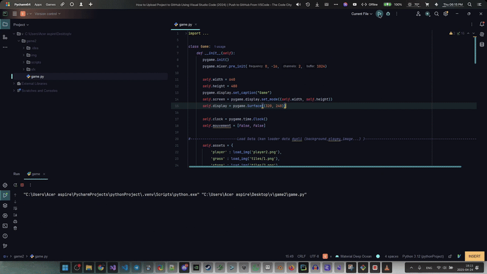

# 2D Platformer Game 

A fun 2D platformer game built with Pygame. Jump, run, and explore!



##  Features

*    Classic platformer movement (run, jump)
*    Obstacles


##  Getting Started / How to Play

**(Option 1: If it's playable directly from source)**

1.  **Prerequisites:** Make sure you have [mention prerequisites, e.g., Python 3, Pygame library] installed.
    ```bash
    pip install pygame
    ```
2.  **Clone the repository (optional if you already have it):**
    ```bash
    git clone https://github.com/wldoooon/2d_platformer.git
    cd 2d_platformer
    ```
3.  **Run the game:**
    ```bash
    # Example for Python
    python main.py
    ```

**(Option 2: If you have builds/executables)**

1.  Download the latest release from the [Releases](https://github.com/wldoooon/2d_platformer/releases) page.
2.  Unzip the downloaded file.
3.  Run the executable (`game.exe` or similar).

**Controls:**
*   ⬅️ : Move Left
*   ➡️ : Move Right
*   Space : Jump

##  Built With

*   [Framework] - Pygame
*   [Programming Language] - Python


## 🤝 Contributing (Optional)

Contributions are welcome! Please feel free to submit a Pull Request.

